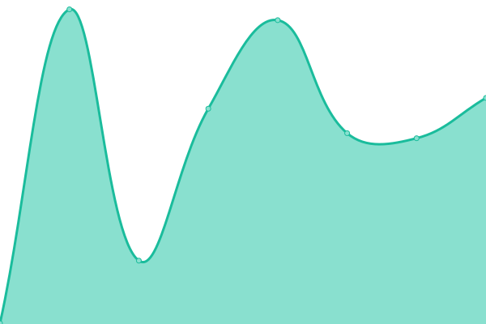

# [📈 Live Status](https://status.thexyz.com): <!--live status--> **🟧 Partial outage**

This repository contains the open-source uptime monitor and status page for [Thexyz](https://www.thexyz.com), powered by [Upptime](https://github.com/upptime/upptime).

With [Upptime](https://upptime.js.org), you can get your own unlimited and free uptime monitor and status page, powered entirely by a GitHub repository. We use [Issues](https://github.com/thexyz/Email-Monitoring/issues) as incident reports, [Actions](https://github.com/thexyz/Email-Monitoring/actions) as uptime monitors, and [Pages](https://status.thexyz.com) for the status page.

<!--start: status pages-->
<!-- This summary is generated by Upptime (https://github.com/upptime/upptime) -->
<!-- Do not edit this manually, your changes will be overwritten -->
<!-- prettier-ignore -->
| URL | Status | History | Response Time | Uptime |
| --- | ------ | ------- | ------------- | ------ |
|  [Gmail](https://mail.google.com) | 🟥 Down | [gmail.yml](https://github.com/Thexyz/Email-Monitoring/commits/HEAD/history/gmail.yml) | 

 0ms
     
 | 

<a href="https://email.downly.net/history/gmail">0.00%</a>
    

|  [Outlook](https://outlook.live.com) | 🟥 Down | [outlook.yml](https://github.com/Thexyz/Email-Monitoring/commits/HEAD/history/outlook.yml) | 

 531ms
     
 | 

<a href="https://email.downly.net/history/outlook">84.87%</a>
    

|  [Yahoo mail](https://mail.yahoo.com) | 🟩 Up | [yahoo-mail.yml](https://github.com/Thexyz/Email-Monitoring/commits/HEAD/history/yahoo-mail.yml) | 

 177ms
     
 | 

<a href="https://email.downly.net/history/yahoo-mail">100.00%</a>
    

|  [iCloud mail](https://www.icloud.com/mail) | 🟩 Up | [i-cloud-mail.yml](https://github.com/Thexyz/Email-Monitoring/commits/HEAD/history/i-cloud-mail.yml) | 

 240ms
     
 | 

<a href="https://email.downly.net/history/i-cloud-mail">100.00%</a>
    

|  [Zoho mail](https://www.zoho.com/mail/) | 🟩 Up | [zoho-mail.yml](https://github.com/Thexyz/Email-Monitoring/commits/HEAD/history/zoho-mail.yml) | 

 484ms
     
 | 

<a href="https://email.downly.net/history/zoho-mail">100.00%</a>
    

|  [Thexyz](https://webmail.thexyz.com) | 🟩 Up | [thexyz.yml](https://github.com/Thexyz/Email-Monitoring/commits/HEAD/history/thexyz.yml) | 

 219ms
     
 | 

<a href="https://email.downly.net/history/thexyz">100.00%</a>
    

|  [YMOZ](https://ymoz.com) | 🟩 Up | [ymoz.yml](https://github.com/Thexyz/Email-Monitoring/commits/HEAD/history/ymoz.yml) | 

 702ms
     
 | 

<a href="https://email.downly.net/history/ymoz">100.00%</a>
    

<!--end: status pages-->

[**Visit our status website →**](https://status.thexyz.com)

## 📄 License

- Powered by: [Upptime](https://github.com/upptime/upptime)
- Code: [MIT](./LICENSE) © [Thexyz](https://www.thexyz.com)
- Data in the `./history` directory: [Open Database License](https://opendatacommons.org/licenses/odbl/1-0/)
